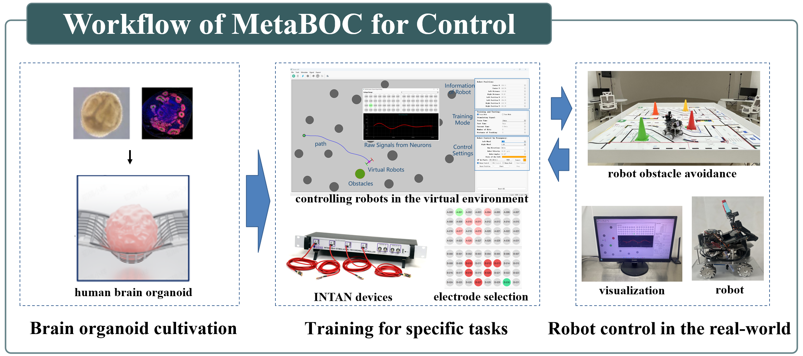
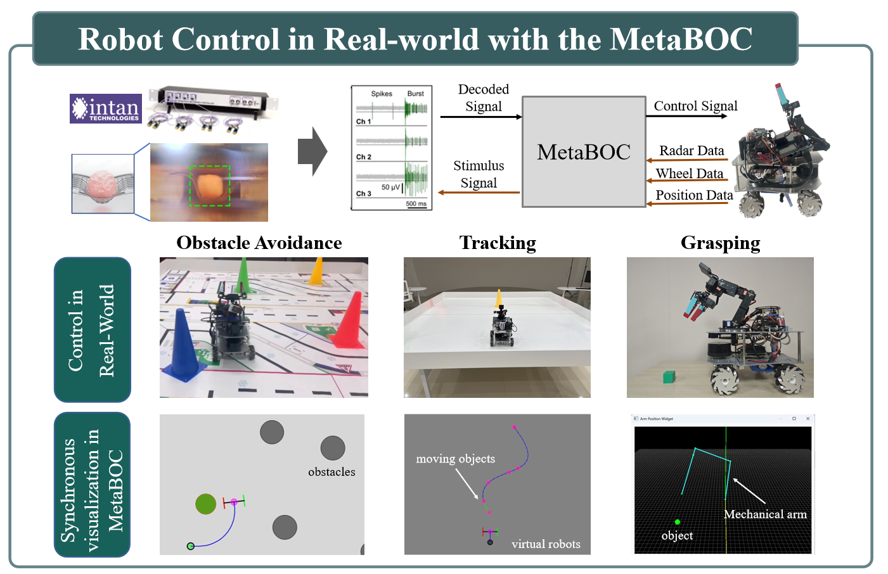

# MetaBOC: Meta Brain-on-a-Chip Interaction Platform

*MetaBOC* is an integrated platform meticulously designed to enable **closed-loop robotic control mediated by human brain organoids**. It establishes a biohybrid architecture, providing a reliable and efficient closed-loop framework for studying real-time embedded interaction between biological neural networks and robotic systems.

### Control framework

The MetaBOC system interfaces​ a brain organoid with both virtual environments and real-world electronic devices, enabling diverse control tasks from​ the brain organoid.

### Multiple control tasks

The MetaBOC system supports three control tasks, including robot obstacle avoidance, object tracking, and robotic arm grasping, enabling the control of real-world devices with synchronization to a virtual environment. It can serve as​ a fundamental tool​ for interdisciplinary research in neuroscience and artificial intelligence.

